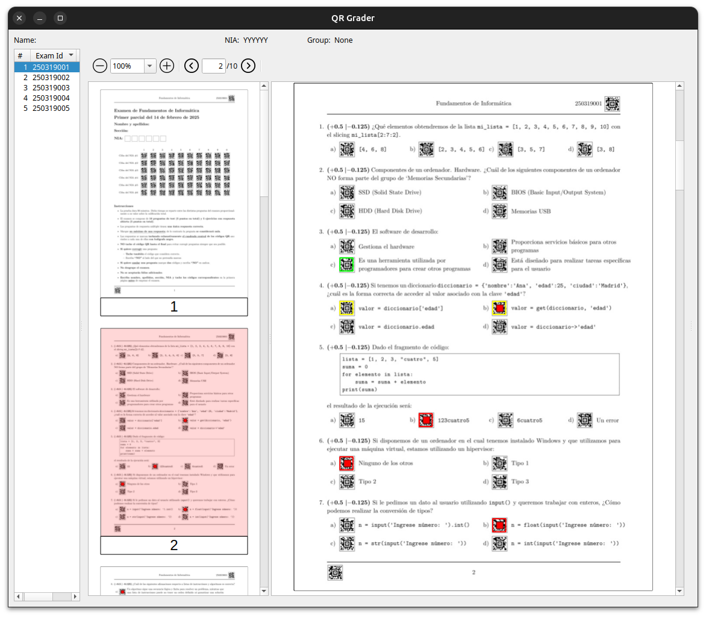

# QRGRADER

## Índice

- [Prerequisites](#prerequisites)
- [Instalación](#installation)
- [Usage](#usage)

QRGrader is a simple python script that allows you to grade
multiple choice questions using QR codes. The script will generate a QR code for each question and the correct answer.
Students can scan the QR code to check their answers. The script will also generate a summary of the results for each
question.

The exam must the prepared in a latex file using the style document provided.

## Prerequisites (Linux)

- Python 3.12
- `texlive-full`

To install `texlive-full` on Ubuntu, run the following command:

```bash
sudo apt install texlive-full
```

## Prerequisites (Windows)

- Python 3.12
- [Miktex](https://miktex.org/)
- [Visual C++ Redistributable for Visual Studio 2015](https://www.microsoft.com/en-us/download/details.aspx?id=48145)
- [Media Feature Pack for Windows](https://support.microsoft.com/en-us/topic/media-feature-pack-list-for-windows-n-editions-c1c6fffa-d052-8338-7a79-a4bb980a700a)

## Installation

To install the script, run the following command:

```bash
pip install qrgrading
```

## Usage

All the script command must be executed inside the so-called qr workspace which is
a directory tree called `qrgrading-DDDDDD` with the following structure:

```
qrgrading-250212
├── data
├── source
├── generated
├── scanned
├── results
    ├── xls
    ├── pdf        
```

Inside the `source` directory, the `qrgrading.sty` file is also created together with a sample `main.tex` file.

### Creating a new workspace

To create a new workspace, run the following command:

```bash
qrworkspace -d 250312
Workspace 'qrgrading-250312' created successfully.
```

Generally, the number is the date of the exam. If the scripts is called
without the `-d` option, the current date will be used.

### Preparing the exam

The following is preparing the exam. The source files must be in the `source` directory.

The exam has the following structure:

```latex
\documentclass[oneside,spanish]{article}
\usepackage[aztec, draft]{qrgrading}
\qrgraderpagestyle{Subject name or exam title}

\begin{document}

    \IDMatrix{0.6cm}{\uniqueid}{Student ID figure}

    \begin{exam}[shuffle=all, style=matrix, showcorrect=no, encode=yes]

        \question[score=0.5, penalty=0.125, brief=first]{1}
        {Stem 1}
        {Key}
        {Distractor 1}
        {Distractor 2}
        {Distractor 3}

%%

        \question[score=0.5, penalty=0.125, brief=second, style=horizontal]{2}
        {Stem 2}
        {Key}
        {Distractor 1}
        {Distractor 2}
        {Distractor 3}

%%

        \question[score=0.5, penalty=0.125, brief=third, style=list]{3}
        {Stem 3}
        {Key}
        {Distractor 1}
        {Distractor 2}
        {Distractor 3}
    \end{exam}
\end{document} 
```

The main file must be called `main.tex`.

The exam environment has the following options:

- `shuffle`: The questions can be shuffled. The options are `all`, `questions`, `answers`, and `none`.
- `style`: The default style of the exam. The options are `matrix`, `horizontal`, and `list`.
- `showcorrect`: Show the correct answers. The options are `yes` and `no`.
- `encode`: Encode the answers in the QR code. The options are `yes` and `no`.

The `question` has six parameters:

- Question number (must be a number and they must be consecutive)
- Stem of the question
- Four answer options (key and distractors)

Its environment has the following options (all are optional):

- `score`: The score of the question.
- `penalty`: The penalty of the question.
- `brief`: A brief description of the question.
- `style`: The style of the question. The options are `matrix`, `horizontal`, and `list`.

Any Latex code that works inside an environment can be used inside the `question` environment. On the other cases, it is useful to prepare the code in a
different file and use the `\input` command inside the `question` environment.

### Generating the exams

To generate the exams run the following command:

```bash
qrgenerator -n 10
``` 

Where `-n` is the number N of exams to generate.
In this example the `qrgenerator` will generate 10 exams in the `generated` directory. Both the order of the questions and the answers will be different for
each exam. The file name will have the format `DDDDDDNNN.pdf` where `DDDDDD` is the date of the exam
and `NNN` is the number of the exam from `001` to `NNN`, in this case `010`.

### Grading the exams

Once the students have answered the exam, the exams must be scanned at 400dpi/color with a normal scanner.
The scanned files must be put afterwards in the `scanned` directory.
The grading is carried out with the following command:

```bash
qrscanner -se
```

This command will process the and generate a set of files in the `results` directory.
Specifically, the `results/pdf` directory will contain the recontructed pdf files named in the same
way as the generated files.

On the other hand, the `results/xls` directory will contain the results in a set of
csv files as follows:

- `DDDDDD_raw.csv`: A file in which each row contains the exam number, and a set of `1 and `0` and values organized in group of
  4 that resent wether or not the student has marked a specific question
- `DDDDDD_nia.csv`: A file in which each row contains the exam number and the student ID
- `DDDDDD_questions.csv`: A file in which each row contains a information about the questions (actually generated by ```qrgenerator```during the generation
  step)

These files opened with a spreadsheet program will allow to grade the exams.

### Graphical user interface

Sometimes, students mark an answer, and later they want to modify that answer.
Since it is impossible to erase the QR code, in these cases they are instructed to mark  
also the chosen answer and write "NO" beside the answer they want to erase.
It will result in an question with two marked answers that can be easily identified.
To facilitate the grading of these cases, we created a graphical user interface that allows to
unmark the answer that has been marked by mistake.
To use the graphical user interface, run the following command from within the workspace directory

```bash
qrgrader
```

The graphical user interface will open as follows:


On the left side the exam number is shown, and the PDF file is displayed on the right side.
The marked answers are shown in green and red. When a question has two marks,
both answers are shown in yellow. Double-clicking on the answer will unmark it.

### Annotating the exams

Once all the double marks have been removed, the exams can be annotated to show
the correctly and incorrecly marked answers in the PDF itself that can be given to the students as a feedback. To do this, run the following command:

```bash
qrscanner -a
```

This will annotate the PDF files in the `results/pdf` directory with the correct and incorrect answers.

### CSV files format details

The `DDDDDD_raw.csv` file has the following format (the space are \t  (tabs) in the file):

```
DDDDDD NNN Q1A Q1B Q1C Q1D Q2A Q2B Q2C Q2D Q3A Q3B Q3C Q3D
```

as for example:

```
250319   1   0   0   1   0   1   0   0   0   1   0   0   0
```

Where `DDDDDD` is the date of the exam, `NNN` is the number of the exam, and
`Q1A` is the `A` option, Q1B is the `B` option, and so on. If the student has marked the option, the value is `1`,
otherwise `0`.

-----
The `nia.csv` file has the following format:

```
DDDDDDNNN   NIA
```

as for example:

```
250319001   123456
```

Where `DDDDDD` is the date of the exam, `NNN` is the number of the exam, and `NIA` is
the student ID. Notice that in this case the
-----

The `questions.csv` file has the following format:

```
N TYPE   SA   SB   SC   SD BRIEF
```

as for example:

``` 
1    Q  0.5 -0.1 -0.1 -0.1 for_loop
2    Q  0.5 -0.1 -0.1 -0.1 error_handling
3    Q  0.5 -0.1 -0.1 -0.1 sintax_error
```

Where `N` is the question number, `TYPE` is the question type, `SA`, `SB`, `SC`, and `SD` are the scores for each
option, and `BRIEF` is a brief description of the question that are all recovered automatically from
the latex file.
